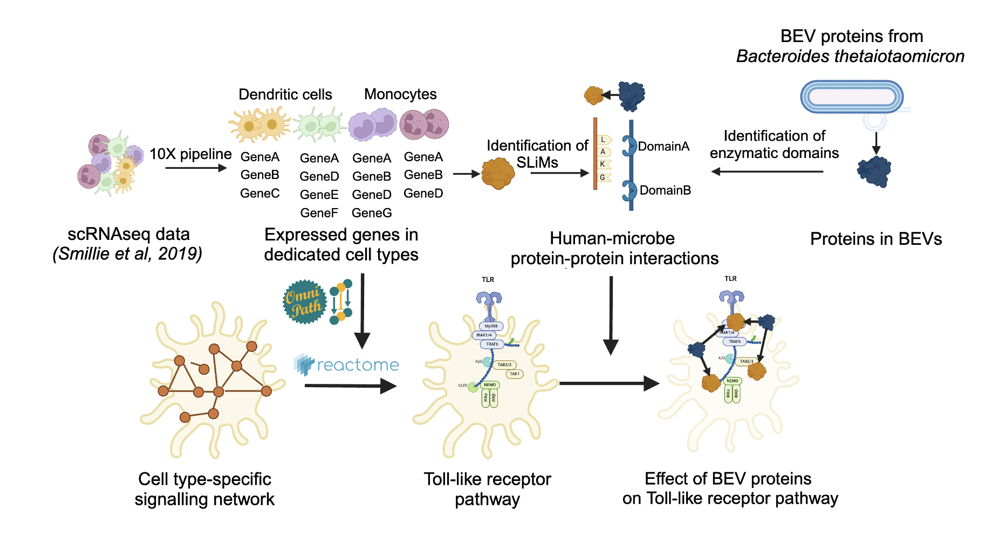

<h1>MicrobioLink</h1>

<strong>A Tool for Predicting Host-Microbe Interactions and Their Downstream Effects on Host Cells</strong>

<h2>Overview</h2>

MicrobioLink is a computational pipeline designed to predict host-microbe protein-protein interactions and analyze their downstream effects on host cellular signaling pathways. By integrating multi-omic data and network biology approaches, MicrobioLink provides insights into how microbial interactions can impact host homeostasis and contribute to disease mechanisms.

This tool is especially useful for researchers investigating complex interspecies interactions and their implications in health and disease contexts, such as inflammatory bowel disease (IBD).

<h2>Key Features</h2>
<ul>
  <li><strong>Prediction of Host-Microbe Protein-Protein Interactions</strong>: Uses structural data and domain-motif interactions to predict interactions between microbial proteins and host proteins.</li>
  <li><strong>Multi-omic Data Integration</strong>: Combines transcriptomic data and proteomics data to create a comprehensive model of host-microbe interactions.</li>
  <li><strong>Downstream Signaling Network Analysis</strong>: Models how microbial interactions affect host cellular processes and identifies impacted signaling pathways.</li>
  <li><strong>Visualize Networks in Cytoscape</strong>: Supports export to Cytoscape for interactive visualization of host-microbe interaction networks.</li>
</ul>

<h2>Installation</h2>

<h3>Prerequisites</h3>
<ul>
  <li><strong>Python 3.9</strong></li>
  <li><strong>Cytoscape 3.10.1</strong></li>
  <li>Additional Python libraries:
    <ul>
      <li><code>pandas</code>, <code>numpy</code>, <code>scipy</code>, <code>mygene</code>, <code>omnipath</code>, <code>pyfasta</code>, <code>biopython</code></li>
    </ul>
  </li>
</ul>

<h3>Setup</h3>
<ol>
  <li><strong>Clone the Repository</strong>:
    <pre><code>git clone https://github.com/korcsmarosgroup/MicrobioLink2.git
cd MicrobioLink2</code></pre>
  </li>
  <li><strong>Set up the Environment</strong>:
    
Using Conda (recommended):

    <pre><code>conda create --name microbiolink --file workflow/microbiolink_env.yml
conda activate microbiolink</code></pre>
  </li>
  <li><strong>Alternative Setup Without Conda</strong>:
    <pre><code>python3 -m venv microbiolink_env
source microbiolink_env/bin/activate  # On Windows: microbiolink_env\Scripts\activate
pip install -r workflow/requirements.txt</code></pre>
  </li>
</ol>

<h2>Usage</h2>

<h3>Input Requirements</h3>
<ul>
  <li><strong>Human Transcriptomics Data</strong>: CSV file with gene symbols and normalized average expression counts.</li>
  <li><strong>Endpoint File</strong>: Defines target genes or differentially expressed genes to be analyzed.</li>
  <li><strong>Bacterial Proteomics Data</strong>: List of bacterial proteins as UniProt IDs or a UniProt Proteome (UP) ID.</li>
</ul>

<h3>Running the Pipeline</h3>

<ol>
  <li><strong>Prepare and Filter Data</strong>:
    <pre><code>python workflow/z-score_filter_terminal.py --input_file &lt;input.csv&gt; --output_file &lt;output.csv&gt; --zscore -3</code></pre>
  </li>
  <li><strong>Predict Protein-Protein Interactions</strong>:
    <pre><code>python workflow/DMI.py --fasta_file &lt;human_fasta.fasta&gt; --elm_regex_file &lt;elm_classes.tsv&gt; --motif_domain_file &lt;motif_domains.tsv&gt; --bacterial_domain_file &lt;bacterial_domains.tsv&gt; --output_file &lt;output.csv&gt;</code></pre>
  </li>
  <li><strong>Run TieDIE for Downstream Analysis</strong>:
    <pre><code>python workflow/tiedie.py --network &lt;network.sif&gt; --up_heats &lt;upstream.input&gt; --down_heats &lt;downstream.input&gt; --output_folder &lt;output_directory&gt;</code></pre>
  </li>
</ol>

Exported files can be visualized in Cytoscape for further exploration of host-microbe interaction networks.

For a full, step-by-step protocol, please refer to the detailed guide in the <a href="https://github.com/korcsmarosgroup/MicrobioLink2/blob/main/MicrobioLink_protocol.pdf">documentation</a>.

<h2>Troubleshooting</h2>

<strong>Common Errors</strong>: Refer to the "Troubleshooting" section in the documentation for solutions to common issues, such as package dependencies, data formatting, and parameter specifications.

<h2>Citation</h2>

If you use MicrobioLink in your research, please cite:

<ul>
  <li>Poletti et al., 2022 and Gul et al., 2022.</li>
</ul>

