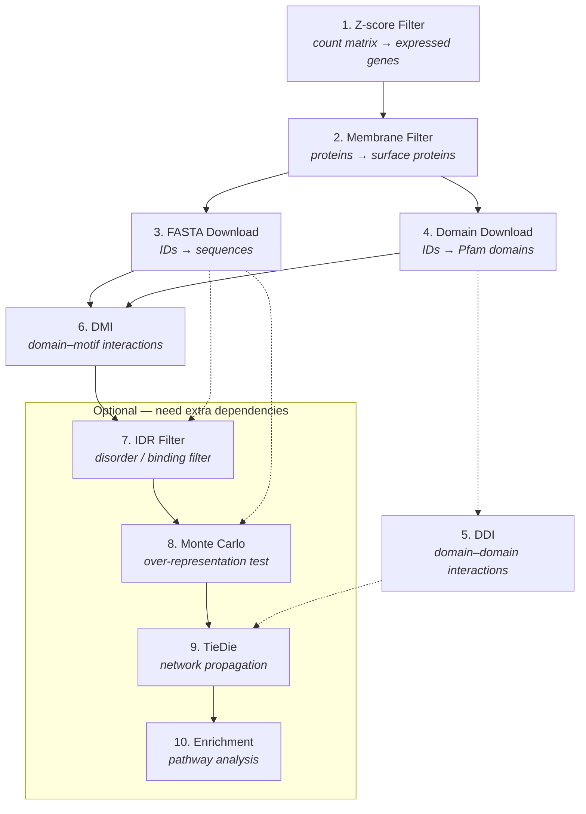

# Pipeline Concepts

This page is the conceptual reference for the MicrobioLink pipeline: what each module
does, how the modules pass data to one another, what "forward" and "reverse"
MicrobioLink mean, and why some modules are optional. The tutorials link back here
rather than re-explaining the pipeline, so if a tutorial mentions a module or a
direction, this is the page that defines it.

If you just want a one-line summary of each module, the [home page](index.md#the-pipeline-modules)
has that. This page goes a level deeper into how they connect.

## The pipeline at a glance

MicrobioLink turns host transcriptomics and a set of microbial proteins into a
predicted host-microbe interaction network and traces its downstream effect on host
signalling. It is organised as ten modules. Each module is a small, self-contained
step: it reads the output of an earlier step, does one job, and writes a file the next
step can read. Every module is also a plain Python function, so you can run the whole
pipeline from the command line, from Python, or mix the two — and you can enter the
pipeline at whichever module your data already lines up with.

The diagram shows the forward-direction data flow. Solid arrows are the main path;
dashed arrows are optional inputs.

The predicted interactions accumulate as you go: modules 1–6 build and predict the
host-microbe interactions, modules 7–8 filter them down to the most confident ones, and
modules 9–10 take those interactions into the host cell and ask what they *do*. You can
stop at any point — a project that only needs a list of predicted host-microbe binding
pairs never has to run TieDie or enrichment.

## Forward vs reverse MicrobioLink

Host-microbe protein interactions in MicrobioLink are predicted through **domain-motif
interactions (DMIs)**: one partner contributes a globular **Pfam domain**, the other
contributes a **short linear motif** in its sequence that the domain recognises. Which
species plays which role is the *direction* of the analysis, and it is chosen by the
user (Module 6's `--mode`).

- **Forward MicrobioLink** — the **microbial** protein carries the **domain** and the
  **host** protein carries the **motif** (bacterial domain → host motif). Motifs are
  searched in the *human* sequences and matched against *bacterial* domains. This is the
  common case: a secreted or surface microbial protein presenting a domain that grabs a
  motif on a host protein.
- **Reverse MicrobioLink** — the **host** protein carries the **domain** and the
  **microbial** protein carries the **motif** (human domain → bacterial motif). Motifs
  are searched in the *bacterial* sequences and matched against *human* domains.
  Cleavage-site motif classes (ELM `CLV_` classes) are excluded in this direction,
  because they are eukaryotic-protease-specific and not meaningful when searched in a
  bacterial sequence.
- **Both** — run the forward and reverse predictions together; the combined table
  carries a `dmi_type` column of `forward` / `reverse` so every downstream module can
  tell the two apart.

The direction decides **which species you need which data for**. The motif side needs a
FASTA sequence (Module 3) to search motifs in; the domain side needs a Pfam domain table
(Module 4). So forward needs *human FASTA + bacterial domains*, reverse needs *bacterial
FASTA + human domains*, and both needs all four. Domain-domain interactions (Module 5)
are undirected — they compare both species' domain sets directly — so they are not
affected by this choice.

## The ten modules

Each subsection below gives what the module does, what it takes in, what it produces,
and — the load-bearing part — **what its output feeds** next. The CLI command is listed
for reference; the same work is available as a public function for use from Python.

### 1. Z-score Filter

Removes lowly expressed genes from a host gene count matrix. For each sample column it
fits the expression distribution and keeps a gene's original count only where its
column-wise z-score exceeds the user-supplied cut-off; everything below the cut-off
becomes `NaN`. This is the entry point for a transcriptomics-driven run: it decides
which host genes count as "expressed" and therefore worth carrying forward.

- **Input:** a gene count matrix (genes as rows, samples as columns) and a z-score cut-off.
- **Output:** the same-shape matrix with sub-threshold values replaced by `NaN`.
- **Feeds:** the expressed host gene symbols become the identifier input to the
  **Membrane Filter (2)** and **FASTA / Domain download (3, 4)** on the human side.
- **CLI:** `microbiolink-zscore-filter`

### 2. Membrane Protein Filter

Narrows a protein set to the proteins that can plausibly meet a partner from the other
organism — surface-exposed, membrane, or secreted proteins — and annotates each survivor
with its location. Human and microbial proteins use different evidence:

- **Human** proteins are filtered through OmniPath's InterCell classification.
- **Microbial** proteins are filtered on UniProt's free-text subcellular-location
  annotation (e.g. outer-membrane, plasma-membrane, secreted).

Both paths return the same shape so downstream code is species-agnostic.

- **Input:** UniProt IDs, a UniProt proteome ID (microbial only), human gene symbols, or
  gene symbols extracted from a count matrix; plus `species` and the location filters.
- **Output:** a table with one row per surviving protein — `uniprot_id` and
  `location_annotation`.
- **Feeds:** the surviving UniProt IDs are the identifier input to **FASTA Download (3)**
  and **Domain Download (4)**. This module is optional in practice — you can skip it if
  your protein set is already curated.
- **CLI:** `microbiolink-membrane-filter`

### 3. FASTA Download

Retrieves protein sequences from UniProt. It accepts the same kinds of identifier as the
membrane filter (UniProt IDs, gene symbols resolved via MyGene.info, or a proteome ID
that is expanded to its member accessions first) and writes one FASTA file per species.

- **Input:** human and/or microbial identifiers plus their `id_type`, and an output folder.
- **Output:** `human_proteins.fasta` and/or `microbial_proteins.fasta`.
- **Feeds:** the sequences are the **motif-search input to DMI (6)** and the sequences
  scored by **IDR (7)** and **Monte Carlo (8)**. Which species you download depends on
  the [direction](#forward-vs-reverse-microbiolink).
- **CLI:** `microbiolink-download-fasta`

### 4. Domain Download

Finds the Pfam domains carried by each protein by fetching UniProt's domain annotation,
then inverts the result into a domain-keyed mapping.

- **Input:** human and/or microbial identifiers plus their `id_type` (same contract as
  Module 3).
- **Output:** a `pfam_id → [uniprot_id, …]` mapping per species — one Pfam domain per
  key, listing the proteins that carry it — written as a `Pfam` / `Entries` TSV
  (`human_domains.tsv` / `microbial_domains.tsv`).
- **Feeds:** the domain mappings are the input to **DDI (5)** and the domain side of
  **DMI (6)**. The domain-keyed shape is deliberate: it is exactly what the interaction
  lookups in Modules 5 and 6 consume, with no reshaping.
- **CLI:** `microbiolink-download-domains`

### 5. Domain-Domain Interactions (DDI)

Predicts interactions between the two species' domains. It builds a set of known
interacting Pfam pairs from the packaged **3did** and **DOMINE (high-confidence)**
resources, then for every bacterial-domain / human-domain pair present in the two inputs
that is a known interacting pair, cross-joins the proteins carrying those domains.

- **Input:** a bacterial and a human domain mapping (Module 4's output shape).
- **Output:** a table of predicted DDIs — `bacterial_uniprot_id`,
  `bacterial_pfam_domain`, `human_uniprot_id`, `human_pfam_domain`, and a `resource`
  column recording which resource(s) supported each pair.
- **Feeds:** an **optional** additional evidence source for **TieDie (9)**, where its
  host-microbe protein pairs are merged with the DMI pairs. DDI is a side branch, not a
  step in the main motif path.
- **CLI:** `microbiolink-ddi`

### 6. Domain-Motif Interactions (DMI)

The core host-microbe prediction. For each motif class it regex-searches the motif across
one species' sequences, and for every Pfam domain known to interact with that motif
class it cross-joins each motif hit against every partner-species protein carrying that
domain. Known DMIs come from the packaged **ELM** and **3did** resources. The `--mode`
argument (`forward` / `reverse` / `both`) selects the
[direction](#forward-vs-reverse-microbiolink) and therefore which FASTA and which domain
table it reads.

- **Input:** the FASTA of the motif-bearing species (Module 3) and the domain mapping of
  the partner species (Module 4), for whichever direction(s) `mode` requires.
- **Output:** one row per predicted interaction, with `dmi_type`, the bacterial and human
  UniProt IDs and their annotations (Pfam ID on the domain side, motif class on the motif
  side), the motif's `start`/`end` position, and the `resource`.
- **Feeds:** the DMI table is the input to **IDR (7)**. If you do not need the confidence
  filters, it can go straight to **TieDie (9)** — TieDie reads only the protein-pair
  columns, which are the same in the Module 6, 7, and 8 tables.
- **CLI:** `microbiolink-dmi`

### 7. Intrinsic Disorder Region (IDR) Prediction

Filters the DMI table to interactions whose motif sits in a disordered, binding-competent
stretch of its protein. Short linear motifs bind through disordered regions, so a motif
predicted inside a well-folded region is likely a false positive. Each motif window is
scored per-residue for disorder and for binding likelihood (via **IUPred2/ANCHOR2** or
**AIUPred**), and a row is kept only if *every* residue in the window clears both the
disorder cut-off and the binding cut-off.

- **Input:** Module 6's DMI table plus the FASTA sequences its positions were measured
  against; a `method` (`iupred` / `aiupred`) and the two cut-offs.
- **Output:** the surviving rows of the DMI table with three added columns —
  `disordered_score`, `binding_score`, `combined_score` (the window's mean scores).
- **Feeds:** the filtered table is the input to **Monte Carlo (8)**, or straight to
  **TieDie (9)**.
- **Optional** — requires the `idr` extra (see [below](#optional-modules-and-extras)).
- **CLI:** `microbiolink-idr-filter`

### 8. Monte Carlo Simulation

Adds a statistical significance test on top of the IDR filter. For each motif it locates
the disordered region the motif sits in, counts how often the motif's regex occurs there,
then compares that against many synthetic regions of the same length drawn from the
pooled amino-acid composition of the species' disordered regions. This asks whether the
motif is *over-represented* — more frequent than the disordered proteome's composition
alone would predict. Raw p-values across all tested motif instances are corrected for
multiple testing with Benjamini-Hochberg, and a motif passes if its q-value clears the
target false-discovery rate.

- **Input:** Module 7's IDR-filtered table plus the same FASTA sequences; the same
  disorder `method`/`cut-off` arguments, plus `iterations`, `alpha`, and a random `seed`.
- **Output:** the passing rows with four added columns — `monte_carlo_hits`,
  `monte_carlo_pvalue`, `monte_carlo_qvalue`, `passes_monte_carlo`.
- **Feeds:** the most stringently filtered DMI table; feeds **TieDie (9)**.
- **Optional** — also requires the `idr` extra, because it computes disorder profiles the
  same way Module 7 does.
- **CLI:** `microbiolink-monte-carlo`

### 9. TieDie

Takes the predicted host-microbe interactions into the host cell. TieDie ("Tied Diffusion
for Subnetwork Discovery") connects an **upstream** node set — the host proteins targeted
by microbial proteins — to a **downstream** node set — the transcription factors inferred
to drive the user's differentially expressed genes — by heat diffusion over a human
signalling network fetched live from OmniPath. It runs in three steps: build the TieDie
input files, run the tied-diffusion algorithm, and reassemble its output into a readable
network. The upstream targets come from the DMI table, optionally augmented with the DDI
table (Module 5) — both reduce to the same `(human, bacterial)` protein pairs.

- **Input:** a DMI-shaped table (from Module 6, 7, **or** 8, depending on how much
  filtering you want), a differentially-expressed-gene list with log-fold-change values,
  and an expressed-gene list to contextualise the network; optionally a DDI table.
- **Output:** a final host-microbe signalling network file and a per-node annotation table.
- **Feeds:** the whole network — or just its host targets — is the input to
  **Enrichment (10)**.
- **Optional** — requires the `tiedie` extra.
- **CLI:** `microbiolink-tiedie`

### 10. Functional Enrichment Analysis

The end of the pipeline: it asks which pathways or ontology terms are over-represented
among the host proteins the microbes engage. It has two entry points selected by
`--analysis_level`:

- **`HMI`** — enrich over the direct host targets of microbial proteins, taken from a DMI
  table (or a DDI table — same `human_uniprot_id` column). Does not require TieDie.
- **`TieDIE`** — enrich over **every node** of the Module 9 network: the binding proteins
  plus the whole recovered downstream signalling subnetwork.

Both levels converge on the same output. Targets are translated to human gene symbols and
run through Enrichr (via `gget`) against a user-supplied background gene universe.

- **Input:** a DMI/DDI table or a Module 9 network, a background gene-symbol list, and a
  gene-set library (default `Reactome_2022`).
- **Output:** a table of significantly enriched terms and a top-20 enrichment plot.
- **Feeds:** nothing — this is the final result.
- **Optional** — requires the `enrichment` extra.
- **CLI:** `microbiolink-enrichment`

## Optional modules and extras

A base install of MicrobioLink runs **modules 1–6** — everything needed to predict and
list host-microbe interactions. The later modules are optional in two senses: you only
run them if your question needs them, and they carry heavy dependencies that are kept out
of the base install and installed on demand as **extras**.

| Extra | Modules it enables | What it pulls in | Add it when you want to… |
|-------|--------------------|------------------|--------------------------|
| `idr` | 7 (IDR filter), 8 (Monte Carlo) | IUPred/AIUPred (AIUPred pulls in `torch`) | raise confidence in the predicted DMIs by keeping only motifs in disordered, binding-competent regions, and test them for over-representation |
| `tiedie` | 9 (TieDie) | the `tiedie` package (and `networkx`) | trace the interactions into host signalling and recover the downstream subnetwork driving your DEGs |
| `enrichment` | 10 (Enrichment) | `gget`, `matplotlib` | find the pathways / ontology terms over-represented among the engaged host proteins |

Install an extra with, for example, `pip install "microbiolink[idr]"` (see
[Get Started](get-started.md) for the details).

Why they are separated rather than always installed:

- **They are heavy or specialised.** AIUPred pulls in `torch`; TieDie and enrichment pull
  in their own scientific stacks. Users who only need the interaction predictions
  (modules 1–6) should not have to install any of it. Each optional module lazy-imports
  its dependency inside the function that uses it, so the package stays importable without
  the extra.
- **The pipeline legitimately ends early.** A project that only needs a list of predicted
  host-microbe binding pairs stops after Module 6. One that wants confident predictions
  adds `idr` (Modules 7–8). One that wants downstream biology adds `tiedie` (Module 9) and
  `enrichment` (Module 10). You add an extra exactly when you reach the module that needs
  it.

Because each module reads a file (or a DataFrame) and writes one, you can also enter the
pipeline partway through: if you already have a DMI-shaped table, you can run TieDie on it
without re-running the prediction modules. The [tutorials](tutorials/index.md) walk
through several such end-to-end and partial runs.
