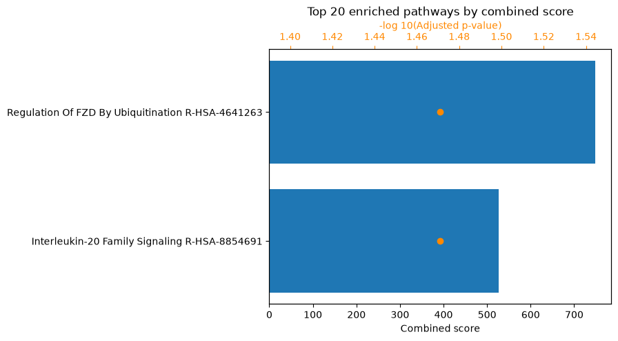

# A default MicrobioLink run, for first-time users (notebook)

This notebook is the **gentlest** way into MicrobioLink. It runs the pipeline the
way a first-time user most often wants it: the **forward direction only** (a
microbial protein presenting a domain that grabs a motif on a host protein), at
the full depth of the pipeline, but without the two branches a newcomer rarely
needs on a first pass &mdash; the [Z-score filter](../concepts.md#1-z-score-filter)
and the [DDI side branch](../concepts.md#5-domain-domain-interactions-ddi).

When you want *everything* &mdash; both directions and every module &mdash; move on
to the [comprehensive notebook](t1_api_full.md). The same run from the terminal is
in the [default command-line tutorial](t4_cli_basic.md).

**The biology.** As in the other tutorials: *Bacteroides thetaiotaomicron*
outer-membrane-vesicle (OMV) proteins against human colonic enterocyte (BEST4)
proteins, in Crohn's disease. See [`data/README.md`](data/README.md).

**Before you start**

- Install the extras this notebook uses:
  `pip install "microbiolink[idr,tiedie,enrichment]"`
  (see [Get Started](../get-started.md#optional-extras)).
- The pipeline and the meaning of *forward* are defined in
  [Pipeline Concepts](../concepts.md).
- The local core (IDR &rarr; Monte Carlo) is deterministic (`iupred`, `seed=0`);
  the download, TieDie and enrichment stages fetch live data, so counts can drift
  slightly.

## Setup

The forward run needs a smaller slice of the API than the comprehensive one: no
Z-score filter, no DDI.


```python
%matplotlib inline
import logging
from pathlib import Path

import pandas as pd

# The live-lookup libraries (mygene/biothings, gget) log a line per query. They
# re-assert their own log level when imported, so a plain setLevel does not stick;
# attach a filter that drops their records and stop them propagating to the root.
class _DropRecords(logging.Filter):
    def filter(self, record):
        return False

for _noisy in ("biothings.client", "gget", "gget.utils", "mygene"):
    _lg = logging.getLogger(_noisy)
    _lg.addFilter(_DropRecords())
    _lg.propagate = False
    _lg.setLevel(logging.ERROR)

from microbiolink.workflow.membrane_filter import filter_membrane_proteins
from microbiolink.workflow.fasta_download import download_fasta
from microbiolink.workflow.domain_download import download_domains
from microbiolink.workflow.dmi import predict_domain_motif_interactions
from microbiolink.workflow.idr_filter import filter_by_disorder
from microbiolink.workflow.monte_carlo import filter_by_monte_carlo
from microbiolink.workflow.tiedie import run_tiedie_pipeline
from microbiolink.workflow.enrichment import run_enrichment_analysis
from microbiolink.utils.fasta import read_fasta_sequences

DATA = Path("data")
WORK = Path("t2_work")
WORK.mkdir(exist_ok=True)
```

## The proteins

Two identifier lists: the human host proteins and the bacterial OMV proteins.


```python
human_ids = pd.read_csv(DATA / "human_proteins.csv")["uniprot_id"].tolist()
bacterial_ids = pd.read_csv(DATA / "bacterial_proteins.csv")["uniprot_id"].tolist()
print(f"{len(human_ids)} human proteins, {len(bacterial_ids)} bacterial (OMV) proteins")
```

    276 human proteins, 243 bacterial (OMV) proteins


## Membrane filter (host side)

We keep the human proteins that are surface-exposed or secreted &mdash; the ones
that can physically meet a microbial protein &mdash; using OmniPath's Intercell
classification. The bacterial OMV proteins are already a localized
(outer-membrane-vesicle) fraction, so we use them directly, without a filter (see
[`data/README.md`](data/README.md)).


```python
HUMAN_LOCATIONS = [
    "plasma_membrane_transmembrane",
    "plasma_membrane_peripheral",
    "secreted",
    "cell_surface",
]
membrane_human = filter_membrane_proteins(human_ids, "uniprot", "human", HUMAN_LOCATIONS)
human_surface = membrane_human["uniprot_id"].tolist()
print(f"human: {len(human_ids)} -> {len(human_surface)} surface/secreted; bacterial: {len(bacterial_ids)} used directly")
```

    human: 276 -> 270 surface/secreted; bacterial: 243 used directly


## Sequences and domains &mdash; the forward direction only

This is where *forward-only* saves work. In the forward direction the **human**
protein carries the motif and the **bacterial** protein carries the domain, so we
need only the **human FASTA** (to search motifs in) and the **bacterial domains**
(to match them against). No bacterial FASTA, no human domains.


```python
fasta_paths = download_fasta(
    WORK,
    human_identifiers=human_surface,
    human_id_type="uniprot",
)
human_sequences = read_fasta_sequences(fasta_paths["human"])

domains = download_domains(
    microbial_identifiers=bacterial_ids,
    microbial_id_type="uniprot",
)
bacterial_domains = domains["microbial"]
print(f"{len(human_sequences)} human sequences, {len(bacterial_domains)} bacterial Pfam domains")
```

    270 human sequences, 323 bacterial Pfam domains


## Domain&ndash;motif interactions (forward)

The core prediction, in `mode="forward"`: bacterial domain &rarr; human motif.


```python
dmi = predict_domain_motif_interactions(
    "forward",
    human_sequences=human_sequences,
    bacterial_domains=bacterial_domains,
)
print(f"{len(dmi)} forward DMIs")
dmi.head()
```

    19104 forward DMIs


<div>
<style scoped>
    .dataframe tbody tr th:only-of-type {
        vertical-align: middle;
    }

    .dataframe tbody tr th {
        vertical-align: top;
    }

    .dataframe thead th {
        text-align: right;
    }
</style>
<table border="1" class="dataframe">
  <thead>
    <tr style="text-align: right;">
      <th></th>
      <th>dmi_type</th>
      <th>bacterial_uniprot_id</th>
      <th>bacterial_annotation</th>
      <th>human_uniprot_id</th>
      <th>human_annotation</th>
      <th>start</th>
      <th>end</th>
      <th>resource</th>
    </tr>
  </thead>
  <tbody>
    <tr>
      <th>0</th>
      <td>forward</td>
      <td>Q8A0Y2</td>
      <td>PF00082</td>
      <td>A1A5B4</td>
      <td>CLV_PCSK_PC1ET2_1|CLV_PCSK_KEX2_1</td>
      <td>285</td>
      <td>288</td>
      <td>ELM</td>
    </tr>
    <tr>
      <th>1</th>
      <td>forward</td>
      <td>Q8A0Y2</td>
      <td>PF00082</td>
      <td>A1A5B4</td>
      <td>CLV_PCSK_SKI1_1</td>
      <td>73</td>
      <td>78</td>
      <td>ELM</td>
    </tr>
    <tr>
      <th>2</th>
      <td>forward</td>
      <td>Q8A0Y2</td>
      <td>PF00082</td>
      <td>A1A5B4</td>
      <td>CLV_PCSK_SKI1_1</td>
      <td>90</td>
      <td>95</td>
      <td>ELM</td>
    </tr>
    <tr>
      <th>3</th>
      <td>forward</td>
      <td>Q8A0Y2</td>
      <td>PF00082</td>
      <td>A1A5B4</td>
      <td>CLV_PCSK_SKI1_1</td>
      <td>167</td>
      <td>172</td>
      <td>ELM</td>
    </tr>
    <tr>
      <th>4</th>
      <td>forward</td>
      <td>Q8A0Y2</td>
      <td>PF00082</td>
      <td>A1A5B4</td>
      <td>CLV_PCSK_SKI1_1</td>
      <td>185</td>
      <td>190</td>
      <td>ELM</td>
    </tr>
  </tbody>
</table>
</div>


## IDR filter

Keep only the DMIs whose motif sits in a disordered, binding-competent region
(`iupred`, cut-offs `0.5`). Only human sequences are needed &mdash; every row is a
forward interaction, so the motif is always on the human side.


```python
idr = filter_by_disorder(
    dmi,
    human_sequences,
    None,
    method="iupred",
    disorder_cutoff=0.5,
    binding_cutoff=0.5,
)
print(f"{len(idr)} DMIs pass the IDR filter")
idr.head()
```

    1463 DMIs pass the IDR filter


<div>
<style scoped>
    .dataframe tbody tr th:only-of-type {
        vertical-align: middle;
    }

    .dataframe tbody tr th {
        vertical-align: top;
    }

    .dataframe thead th {
        text-align: right;
    }
</style>
<table border="1" class="dataframe">
  <thead>
    <tr style="text-align: right;">
      <th></th>
      <th>dmi_type</th>
      <th>bacterial_uniprot_id</th>
      <th>bacterial_annotation</th>
      <th>human_uniprot_id</th>
      <th>human_annotation</th>
      <th>start</th>
      <th>end</th>
      <th>resource</th>
      <th>disordered_score</th>
      <th>binding_score</th>
      <th>combined_score</th>
    </tr>
  </thead>
  <tbody>
    <tr>
      <th>0</th>
      <td>forward</td>
      <td>Q8A5K0</td>
      <td>PF00595</td>
      <td>O00548</td>
      <td>LIG_PDZ_Class_1</td>
      <td>717</td>
      <td>723</td>
      <td>ELM</td>
      <td>0.709450</td>
      <td>0.522649</td>
      <td>0.616050</td>
    </tr>
    <tr>
      <th>1</th>
      <td>forward</td>
      <td>Q8A5K0</td>
      <td>PF00595</td>
      <td>O00548</td>
      <td>3DID_PDZ_LIG_0-49</td>
      <td>720</td>
      <td>723</td>
      <td>3did</td>
      <td>0.801067</td>
      <td>0.512617</td>
      <td>0.656842</td>
    </tr>
    <tr>
      <th>2</th>
      <td>forward</td>
      <td>Q8A5K0</td>
      <td>PF00595</td>
      <td>O00548</td>
      <td>3DID_PDZ_LIG_4-6</td>
      <td>651</td>
      <td>654</td>
      <td>3did</td>
      <td>0.571900</td>
      <td>0.570819</td>
      <td>0.571359</td>
    </tr>
    <tr>
      <th>3</th>
      <td>forward</td>
      <td>Q8A0Y2</td>
      <td>PF00082</td>
      <td>O14672</td>
      <td>CLV_PCSK_PC1ET2_1|CLV_PCSK_KEX2_1</td>
      <td>720</td>
      <td>723</td>
      <td>ELM</td>
      <td>0.922600</td>
      <td>0.575922</td>
      <td>0.749261</td>
    </tr>
    <tr>
      <th>4</th>
      <td>forward</td>
      <td>Q89YL8</td>
      <td>PF00754</td>
      <td>O14672</td>
      <td>LIG_NRP_CendR_1</td>
      <td>746</td>
      <td>748</td>
      <td>ELM</td>
      <td>0.994150</td>
      <td>0.996541</td>
      <td>0.995345</td>
    </tr>
  </tbody>
</table>
</div>


## Monte Carlo over-representation test

The statistical filter, at `alpha=0.05` and `seed=0` for reproducibility.


```python
monte_carlo = filter_by_monte_carlo(
    idr,
    human_sequences,
    None,
    method="iupred",
    disorder_cutoff=0.5,
    iterations=1000,
    alpha=0.05,
    seed=0,
)
print(f"{len(monte_carlo)} DMIs pass the Monte Carlo test")
monte_carlo.head()
```

    80 DMIs pass the Monte Carlo test


<div>
<style scoped>
    .dataframe tbody tr th:only-of-type {
        vertical-align: middle;
    }

    .dataframe tbody tr th {
        vertical-align: top;
    }

    .dataframe thead th {
        text-align: right;
    }
</style>
<table border="1" class="dataframe">
  <thead>
    <tr style="text-align: right;">
      <th></th>
      <th>dmi_type</th>
      <th>bacterial_uniprot_id</th>
      <th>bacterial_annotation</th>
      <th>human_uniprot_id</th>
      <th>human_annotation</th>
      <th>start</th>
      <th>end</th>
      <th>resource</th>
      <th>disordered_score</th>
      <th>binding_score</th>
      <th>combined_score</th>
      <th>monte_carlo_hits</th>
      <th>monte_carlo_pvalue</th>
      <th>monte_carlo_qvalue</th>
      <th>passes_monte_carlo</th>
    </tr>
  </thead>
  <tbody>
    <tr>
      <th>0</th>
      <td>forward</td>
      <td>Q8A0L4</td>
      <td>PF00004</td>
      <td>O94985</td>
      <td>3DID_AAA_LIG_0-9</td>
      <td>924</td>
      <td>934</td>
      <td>3did</td>
      <td>0.996410</td>
      <td>0.960024</td>
      <td>0.978217</td>
      <td>0</td>
      <td>0.000999</td>
      <td>0.037054</td>
      <td>True</td>
    </tr>
    <tr>
      <th>1</th>
      <td>forward</td>
      <td>Q8A470</td>
      <td>PF04997</td>
      <td>O94985</td>
      <td>3DID_RNA_pol_Rpb1_1_LIG_3-2</td>
      <td>924</td>
      <td>932</td>
      <td>3did</td>
      <td>0.995513</td>
      <td>0.956707</td>
      <td>0.976110</td>
      <td>0</td>
      <td>0.000999</td>
      <td>0.037054</td>
      <td>True</td>
    </tr>
    <tr>
      <th>2</th>
      <td>forward</td>
      <td>Q8A470</td>
      <td>PF04997</td>
      <td>O94985</td>
      <td>3DID_RNA_pol_Rpb1_1_LIG_3-2</td>
      <td>933</td>
      <td>941</td>
      <td>3did</td>
      <td>0.999850</td>
      <td>0.988348</td>
      <td>0.994099</td>
      <td>0</td>
      <td>0.000999</td>
      <td>0.037054</td>
      <td>True</td>
    </tr>
    <tr>
      <th>3</th>
      <td>forward</td>
      <td>Q8A0L4</td>
      <td>PF00004</td>
      <td>P04626</td>
      <td>3DID_AAA_LIG_0-0|3DID_AAA_LIG_1-1</td>
      <td>1158</td>
      <td>1165</td>
      <td>3did</td>
      <td>0.708286</td>
      <td>0.825046</td>
      <td>0.766666</td>
      <td>0</td>
      <td>0.000999</td>
      <td>0.037054</td>
      <td>True</td>
    </tr>
    <tr>
      <th>4</th>
      <td>forward</td>
      <td>Q8A0L4</td>
      <td>PF00004</td>
      <td>P20333</td>
      <td>3DID_AAA_LIG_1-3</td>
      <td>354</td>
      <td>363</td>
      <td>3did</td>
      <td>0.707589</td>
      <td>0.649045</td>
      <td>0.678317</td>
      <td>1</td>
      <td>0.001998</td>
      <td>0.049405</td>
      <td>True</td>
    </tr>
  </tbody>
</table>
</div>


## TieDie network propagation

Propagate the confident host targets into the host signalling network. Because
this is the default run we do **not** pass a DDI table &mdash; the upstream targets
come from the DMIs alone.

**On `permute`.** This tutorial runs **`permute=10`** so it finishes quickly on any
machine. For real analyses use **`permute=1000`**: on a dataset this size it gives
an essentially identical network, but takes a few minutes and wants a couple of GB
of free memory. TieDie is not seeded, so a higher `permute` makes the result more
stable.


```python
degs = pd.read_csv(DATA / "degs.csv")
expressed_genes = pd.read_csv(DATA / "expressed_counts.csv")["Gene"].astype(str).tolist()

network, nodes = run_tiedie_pipeline(
    dmi_table=monte_carlo,
    endpoint_genes=degs,
    expressed_genes=expressed_genes,
    endpoint_value_column=2,
    permute=10,   # quick; use permute=1000 for real analyses (see note above)
)
print(f"TieDie network: {len(network)} edges / {len(nodes)} nodes")
network.head()
```

    TieDie network: 4399 edges / 1657 nodes


<div>
<style scoped>
    .dataframe tbody tr th:only-of-type {
        vertical-align: middle;
    }

    .dataframe tbody tr th {
        vertical-align: top;
    }

    .dataframe thead th {
        text-align: right;
    }
</style>
<table border="1" class="dataframe">
  <thead>
    <tr style="text-align: right;">
      <th></th>
      <th>Target.node</th>
      <th>Source.node</th>
      <th>Relationship</th>
      <th>layer</th>
    </tr>
  </thead>
  <tbody>
    <tr>
      <th>2</th>
      <td>P04626</td>
      <td>Q8A0L4</td>
      <td>stimulates&gt;</td>
      <td>bacteria-bindingprot</td>
    </tr>
    <tr>
      <th>3</th>
      <td>P20333</td>
      <td>Q8A0L4</td>
      <td>stimulates&gt;</td>
      <td>bacteria-bindingprot</td>
    </tr>
    <tr>
      <th>7</th>
      <td>Q13873</td>
      <td>Q8A5K0</td>
      <td>stimulates&gt;</td>
      <td>bacteria-bindingprot</td>
    </tr>
    <tr>
      <th>8</th>
      <td>Q14118</td>
      <td>Q8A677</td>
      <td>stimulates&gt;</td>
      <td>bacteria-bindingprot</td>
    </tr>
    <tr>
      <th>9</th>
      <td>Q14118</td>
      <td>Q8A5K0</td>
      <td>stimulates&gt;</td>
      <td>bacteria-bindingprot</td>
    </tr>
  </tbody>
</table>
</div>


## Enrichment &mdash; run twice

Enrichment is the payoff, and it is worth running at **two** levels so you can see
the difference:

1. **`HMI`** &mdash; the pathways over-represented among the *direct* host targets
   of the bacteria, straight from the DMI table.
2. **`TieDIE`** &mdash; the pathways over-represented across the *whole* propagated
   network: the direct targets plus the downstream signalling they recruit.

Comparing the two shows what the network propagation adds beyond the direct hits.


```python
from IPython.display import display

background = pd.read_csv(DATA / "background_genes.csv", header=None)[0].astype(str).tolist()

hmi_results, hmi_figure = run_enrichment_analysis(monte_carlo, background, "HMI")
print(f"HMI enrichment: {len(hmi_results)} significant terms")
display(hmi_results.head())
hmi_figure
```

    HMI enrichment: 2 significant terms


<div>
<style scoped>
    .dataframe tbody tr th:only-of-type {
        vertical-align: middle;
    }

    .dataframe tbody tr th {
        vertical-align: top;
    }

    .dataframe thead th {
        text-align: right;
    }
</style>
<table border="1" class="dataframe">
  <thead>
    <tr style="text-align: right;">
      <th></th>
      <th>rank</th>
      <th>path_name</th>
      <th>p_val</th>
      <th>z_score</th>
      <th>combined_score</th>
      <th>overlapping_genes</th>
      <th>adj_p_val</th>
      <th>database</th>
    </tr>
  </thead>
  <tbody>
    <tr>
      <th>0</th>
      <td>1</td>
      <td>Regulation Of FZD By Ubiquitination R-HSA-4641263</td>
      <td>0.000339</td>
      <td>93.641026</td>
      <td>748.078540</td>
      <td>[RNF43, ZNRF3]</td>
      <td>0.033798</td>
      <td>Reactome_2022</td>
    </tr>
    <tr>
      <th>1</th>
      <td>2</td>
      <td>Interleukin-20 Family Signaling R-HSA-8854691</td>
      <td>0.000559</td>
      <td>70.211538</td>
      <td>525.883675</td>
      <td>[IL22RA1, IFNLR1]</td>
      <td>0.033798</td>
      <td>Reactome_2022</td>
    </tr>
  </tbody>
</table>
</div>


    

    


```python
tiedie_results, tiedie_figure = run_enrichment_analysis(network, background, "TieDIE")
print(f"TieDIE enrichment: {len(tiedie_results)} significant terms")
display(tiedie_results.head())
tiedie_figure
```

    TieDIE enrichment: 795 significant terms


<div>
<style scoped>
    .dataframe tbody tr th:only-of-type {
        vertical-align: middle;
    }

    .dataframe tbody tr th {
        vertical-align: top;
    }

    .dataframe thead th {
        text-align: right;
    }
</style>
<table border="1" class="dataframe">
  <thead>
    <tr style="text-align: right;">
      <th></th>
      <th>rank</th>
      <th>path_name</th>
      <th>p_val</th>
      <th>z_score</th>
      <th>combined_score</th>
      <th>overlapping_genes</th>
      <th>adj_p_val</th>
      <th>database</th>
    </tr>
  </thead>
  <tbody>
    <tr>
      <th>0</th>
      <td>1</td>
      <td>Signal Transduction R-HSA-162582</td>
      <td>1.768027e-76</td>
      <td>3.559268</td>
      <td>620.830968</td>
      <td>[CYFIP2, TFRC, MAML1, ITSN1, STMN2, WDR83, RBP...</td>
      <td>2.906637e-73</td>
      <td>Reactome_2022</td>
    </tr>
    <tr>
      <th>1</th>
      <td>2</td>
      <td>Generic Transcription Pathway R-HSA-212436</td>
      <td>2.064974e-59</td>
      <td>4.01188</td>
      <td>542.114892</td>
      <td>[RB1, CCNK, SMARCB1, MAML1, EHMT1, CCNC, RBPJ,...</td>
      <td>1.697408e-56</td>
      <td>Reactome_2022</td>
    </tr>
    <tr>
      <th>2</th>
      <td>3</td>
      <td>Disease R-HSA-1643685</td>
      <td>2.434846e-57</td>
      <td>3.297338</td>
      <td>429.832588</td>
      <td>[RB1, CYFIP2, APP, CCNK, MAML1, ZDHHC5, KEAP1,...</td>
      <td>1.334295e-54</td>
      <td>Reactome_2022</td>
    </tr>
    <tr>
      <th>3</th>
      <td>4</td>
      <td>Immune System R-HSA-168256</td>
      <td>1.780780e-54</td>
      <td>3.156436</td>
      <td>390.648607</td>
      <td>[CYFIP2, IFITM3, APP, CNTFR, IL1RN, IFITM1, LR...</td>
      <td>7.319005e-52</td>
      <td>Reactome_2022</td>
    </tr>
    <tr>
      <th>4</th>
      <td>5</td>
      <td>Cytokine Signaling In Immune System R-HSA-1280215</td>
      <td>1.463913e-52</td>
      <td>5.05129</td>
      <td>602.888186</td>
      <td>[IFITM3, CNTFR, APP, IFITM1, IL1RN, IFI35, IFI...</td>
      <td>4.813346e-50</td>
      <td>Reactome_2022</td>
    </tr>
  </tbody>
</table>
</div>


    

    


## Where to go next

That is a complete, default MicrobioLink run: host targets predicted, filtered for
confidence, propagated into the signalling network, and read out as enriched
pathways &mdash; all in the forward direction.

- Add the reverse direction and every module with the
  [comprehensive notebook](t1_api_full.md).
- Run the same steps from the terminal with the
  [default command-line tutorial](t4_cli_basic.md).
- See [Pipeline Concepts](../concepts.md) and the
  [API Reference](../api/index.md) for the details.
