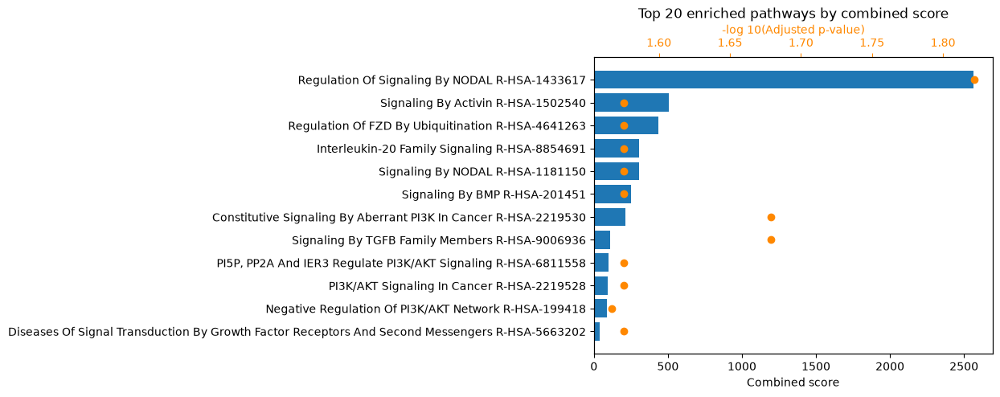
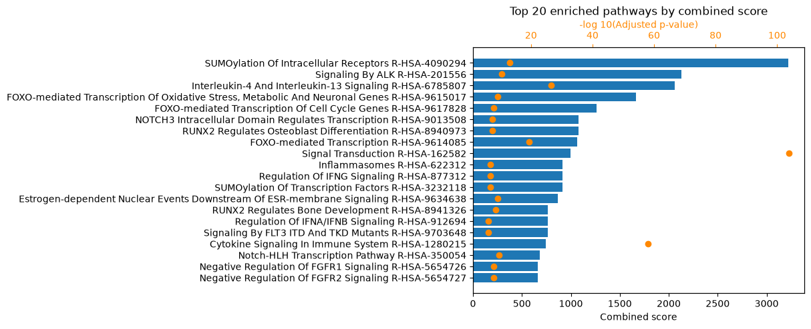

# A comprehensive MicrobioLink run with optional modules (command line)

This tutorial runs the **whole** MicrobioLink pipeline from the terminal, using the
`microbiolink-*` console scripts one module at a time and passing files between the
steps. It covers every stage — membrane filtering, sequence and domain download,
domain–domain and domain–motif prediction, the confidence filters, network
propagation and enrichment — in **both the forward and reverse directions**.

It is the command-line counterpart of the [comprehensive notebook](t1_api_full.md),
and produces the same results. If you would rather drive the pipeline from Python,
use that notebook; if you want a shorter first run, see the
[default command-line tutorial](t4_cli_basic.md).

**The biology.** *Bacteroides thetaiotaomicron* outer-membrane-vesicle (OMV)
proteins against human colonic enterocyte (BEST4) proteins, in Crohn's disease —
the published case study, cut down to a small example dataset (see
[`data/README.md`](data/README.md)).

## Before you start

- Install MicrobioLink with the optional extras this run uses:

    ```bash
    pip install "microbiolink[idr,tiedie,enrichment]"
    ```

    (see [Get Started](../get-started.md#optional-extras)).

- The console scripts and the meaning of *forward* / *reverse* are defined in
  [Pipeline Concepts](../concepts.md).
- The scripts are **quiet**: each one writes its result to a file and exits without
  printing to the screen. So after every command below we peek at the file it wrote
  (`head`, and a row count) to see what happened.
- Several stages fetch data live (UniProt, Pfam, OmniPath, Enrichr), so exact
  counts can drift slightly as those resources are updated. The local core
  (`idr-filter` → `monte-carlo`) is deterministic: it uses `--method iupred` and a
  fixed `--seed`, so it reproduces on rerun.

We run everything from a working directory that holds the example dataset in a
`data/` subfolder, and we write each step's output into the current directory.

## 1. Membrane filter (host side)

The [membrane filter](../concepts.md#2-membrane-protein-filter) keeps the human
proteins that are surface-exposed or secreted — the ones that can physically meet a
microbial protein — using OmniPath's Intercell classification.

```bash
microbiolink-membrane-filter \
    -i data/human_proteins.csv \
    -id uniprot \
    -sp human \
    -lfl plasma_membrane_transmembrane plasma_membrane_peripheral secreted cell_surface \
    -o membrane_human.csv
```

```text
# membrane_human.csv — 270 of 276 human proteins kept
uniprot_id,location_annotation
A1A5B4,cell_surface;plasma_membrane_transmembrane
B4DS77,cell_surface;plasma_membrane_transmembrane
O00468,plasma_membrane_transmembrane;secreted
```

The **bacterial** OMV proteins are handled differently: they are already an
experimentally isolated outer-membrane-vesicle fraction, so the fractionation *is*
the localization step, and in UniProt they carry almost no location annotation. We
therefore use `data/bacterial_proteins.csv` **directly** in the next steps, without
a membrane filter (see [`data/README.md`](data/README.md)).

## 2. Download sequences

[FASTA download](../concepts.md#3-fasta-download) fetches the protein sequences from
UniProt. A both-directions run searches motifs in *both* species, so we download
both. We feed the human side from the membrane-filter output and the bacterial side
from the OMV list.

```bash
microbiolink-download-fasta \
    -hi membrane_human.csv -hid uniprot \
    -mi data/bacterial_proteins.csv -mid uniprot \
    -o .
```

This writes `human_proteins.fasta` (270 sequences) and `microbial_proteins.fasta`
(243 sequences) into the current directory.

## 3. Download domains

[Domain download](../concepts.md#4-domain-download) fetches the Pfam domains each
protein carries and writes a `Pfam` / `Entries` TSV per species — one Pfam domain
per row, listing the proteins that carry it.

```bash
microbiolink-download-domains \
    -hi membrane_human.csv -hid uniprot \
    -mi data/bacterial_proteins.csv -mid uniprot \
    -o .
```

```text
# human_domains.tsv — 328 Pfam domains (microbial_domains.tsv has 323)
Pfam	Entries
PF00001	P08908;P28223;P41595;...
PF00004	O94985;Q9UNA3;...
```

## 4. Domain–domain interactions (DDI)

[DDI](../concepts.md#5-domain-domain-interactions-ddi) predicts interactions
directly between the two species' domains, from the packaged 3did and DOMINE
resources. It is an optional side branch that TieDie can merge in later.

```bash
microbiolink-ddi \
    -b microbial_domains.tsv \
    -hu human_domains.tsv \
    -o ddi.csv
```

```text
# ddi.csv — 1,848 domain–domain interactions
bacterial_uniprot_id,bacterial_pfam_domain,human_uniprot_id,human_pfam_domain,resource
Q8A0L4,PF00004,P46531,PF00023,DOMINE_hc
Q8A0L4,PF00004,Q04721,PF00023,DOMINE_hc
```

## 5. Domain–motif interactions (DMI), both directions

[DMI](../concepts.md#6-domain-motif-interactions-dmi) is the core prediction. With
`--mode both` the output carries a `dmi_type` column separating **forward**
(bacterial domain → human motif) from **reverse** (human domain → bacterial motif).
Both the human FASTA *and* the bacterial FASTA are read, together with both domain
tables.

```bash
microbiolink-dmi \
    -m both \
    -hf human_proteins.fasta \
    -b microbial_domains.tsv \
    -bf microbial_proteins.fasta \
    -hu human_domains.tsv \
    -o dmi.csv
```

```text
# dmi.csv — 63,387 DMIs (forward 19,104 / reverse 44,283)
dmi_type,bacterial_uniprot_id,bacterial_annotation,human_uniprot_id,human_annotation,start,end,resource
forward,Q8A0Y2,PF00082,A1A5B4,CLV_PCSK_PC1ET2_1|CLV_PCSK_KEX2_1,285,288,ELM
forward,Q8A0Y2,PF00082,A1A5B4,CLV_PCSK_SKI1_1,73,78,ELM
```

## 6. IDR filter

Short linear motifs bind through **disordered** regions, so the
[IDR filter](../concepts.md#7-intrinsic-disorder-region-idr-prediction) keeps only
DMIs whose motif sits in a disordered, binding-competent stretch. Because the table
has both directions, we pass **both** FASTA files.

```bash
microbiolink-idr-filter \
    --dmi_file dmi.csv \
    --human_fasta_file human_proteins.fasta \
    --bacterial_fasta_file microbial_proteins.fasta \
    --method iupred \
    --disorder_cutoff 0.5 \
    --binding_cutoff 0.5 \
    -o idr.csv
```

```text
# idr.csv — 1,667 DMIs pass (forward 1,463 / reverse 204)
dmi_type,bacterial_uniprot_id,...,disordered_score,binding_score,combined_score
forward,Q8A5K0,...,0.7094,0.5226,0.6160
```

## 7. Monte Carlo over-representation test

The [Monte Carlo filter](../concepts.md#8-monte-carlo-simulation) tests whether each
motif is *over-represented* in its disordered region. We fix `--seed 0` so the
result is reproducible.

```bash
microbiolink-monte-carlo \
    --interaction_file idr.csv \
    --human_fasta_file human_proteins.fasta \
    --bacterial_fasta_file microbial_proteins.fasta \
    --method iupred \
    --disorder_cutoff 0.5 \
    --iterations 1000 \
    --alpha 0.05 \
    --seed 0 \
    -o monte_carlo.csv
```

```text
# monte_carlo.csv — 207 DMIs pass (forward 113 / reverse 94)
dmi_type,...,monte_carlo_hits,monte_carlo_pvalue,monte_carlo_qvalue,passes_monte_carlo
forward,...,2,0.002997,0.045972,True
```

## 8. TieDie network propagation

[TieDie](../concepts.md#9-tiedie) takes the confident host targets *into* the host
cell, connecting them to the transcription factors driving the differentially
expressed genes by heat diffusion over a human signalling network from OmniPath. We
pass the Monte-Carlo DMIs as the upstream targets, the DDI table as extra evidence,
the DEGs (`--deg_value_column 2` = the `avg_log2FC` column), and the expressed-gene
matrix.

**On `--permute`.** This tutorial uses `--permute 10` so it finishes quickly on any
machine. For real analyses use the more rigorous `--permute 1000` — on a dataset
this size it returns an essentially identical network, but takes a few minutes and
wants a couple of GB of free memory. TieDie is not seeded, so a higher `--permute`
makes the result more stable.

```bash
microbiolink-tiedie \
    --dmi_file monte_carlo.csv \
    --ddi_file ddi.csv \
    --deg_file data/degs.csv --deg_sep , --deg_value_column 2 \
    --transcriptomics_file data/expressed_counts.csv --transcriptomics_sep , --transcriptomics_value_column 2 \
    --permute 10 \
    --network_output tiedie_network.tsv \
    --node_output tiedie_nodes.tsv
```

```text
# tiedie_network.tsv — 8,639 edges (tiedie_nodes.tsv — 2,225 nodes)
Target.node	Source.node	Relationship	layer
O00548	Q8A5K0	stimulates>	bacteria-bindingprot
P04626	Q8A0L4	stimulates>	bacteria-bindingprot
```

## 9. Functional enrichment

Finally, [enrichment](../concepts.md#10-functional-enrichment-analysis) finds the
Reactome pathways over-represented among the engaged host proteins, via Enrichr. The
comprehensive run uses **both** entry points, and each writes a results CSV and a
top-20 plot PNG.

**Direct host targets (`HMI`)** — enrich the human targets straight from the DMI
table:

```bash
microbiolink-enrichment \
    --analysis_level HMI \
    --target_file monte_carlo.csv \
    --background_gene_list data/background_genes.csv --sep , \
    -o enrichment_hmi.csv \
    --output_image enrichment_hmi.png
```

14 Reactome terms are significant. The top of the table:

```text
# enrichment_hmi.csv — 14 significant terms
rank,path_name,p_val,z_score,combined_score,overlapping_genes,adj_p_val,database
1,Regulation Of Signaling By NODAL R-HSA-1433617,8.5e-05,273.7,2565.3,"['ACVR1B', 'ACVR2B']",0.0151,Reactome_2022
```



**Whole propagated network (`TieDIE`)** — enrich every node of the TieDie network:

```bash
microbiolink-enrichment \
    --analysis_level TieDIE \
    --target_file tiedie_network.tsv \
    --background_gene_list data/background_genes.csv --sep , \
    -o enrichment_tiedie.csv \
    --output_image enrichment_tiedie.png
```



The network level recovers many more terms than the direct targets alone: the
downstream signalling the interactions recruit, not just the proteins the bacteria
touch directly.

## Recap

Running the modules in turn narrowed a broad candidate set down to a confident,
interpretable network:

| Step | Command | Result |
| --- | --- | --- |
| Membrane filter | `microbiolink-membrane-filter` | 276 → 270 human surface proteins |
| DDI | `microbiolink-ddi` | 1,848 domain–domain interactions |
| DMI (both) | `microbiolink-dmi -m both` | 63,387 (fwd 19,104 / rev 44,283) |
| IDR filter | `microbiolink-idr-filter` | 1,667 (fwd 1,463 / rev 204) |
| Monte Carlo | `microbiolink-monte-carlo --seed 0` | 207 (fwd 113 / rev 94) |
| TieDie | `microbiolink-tiedie --permute 10` | 8,639 edges / 2,225 nodes |
| Enrichment | `microbiolink-enrichment` | HMI 14 terms · TieDIE ~870 terms |

Where to go next:

- the [default command-line tutorial](t4_cli_basic.md) for the shorter forward-only
  run,
- the notebook tutorials ([comprehensive](t1_api_full.md),
  [default](t2_api_basic.md)) for the same steps from Python,
- [Pipeline Concepts](../concepts.md) and the [API Reference](../api/index.md) for
  the details of each module.
