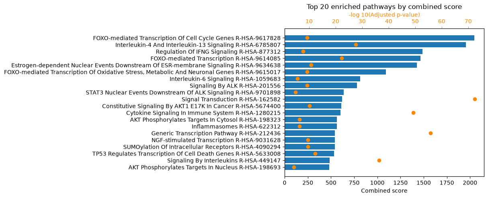

# A default MicrobioLink run, for first-time users (command line)

This tutorial is the **gentlest** way to run MicrobioLink from the terminal. It uses
the `microbiolink-*` console scripts to run the pipeline the way a first-time user
most often wants it: the **forward direction only** (a microbial protein presenting
a domain that grabs a motif on a host protein), at the full depth of the pipeline,
but without the two branches a newcomer rarely needs on a first pass — the
[Z-score filter](../concepts.md#1-z-score-filter) and the
[DDI side branch](../concepts.md#5-domain-domain-interactions-ddi).

When you want *everything* — both directions and every module — move on to the
[comprehensive command-line tutorial](t3_cli_full.md). To drive the same default run
from Python, use the [default notebook](t2_api_basic.md).

**The biology.** As in the other tutorials: *Bacteroides thetaiotaomicron*
outer-membrane-vesicle (OMV) proteins against human colonic enterocyte (BEST4)
proteins, in Crohn's disease. See [`data/README.md`](data/README.md).

## Before you start

- Install MicrobioLink with the optional extras this run uses:

    ```bash
    pip install "microbiolink[idr,tiedie,enrichment]"
    ```

    (see [Get Started](../get-started.md#optional-extras)).

- The console scripts and the meaning of *forward* are defined in
  [Pipeline Concepts](../concepts.md).
- The scripts are **quiet** — each writes a file and exits — so after each command we
  peek at the file it wrote.
- The local core (`idr-filter` → `monte-carlo`) is deterministic (`--method iupred`,
  `--seed 0`); the download, TieDie and enrichment stages fetch live data, so counts
  can drift slightly.

We run from a working directory holding the example dataset in `data/`, writing each
output into the current directory.

## 1. Membrane filter (host side)

Keep the human proteins that are surface-exposed or secreted, using OmniPath's
Intercell classification.

```bash
microbiolink-membrane-filter \
    -i data/human_proteins.csv \
    -id uniprot \
    -sp human \
    -lfl plasma_membrane_transmembrane plasma_membrane_peripheral secreted cell_surface \
    -o membrane_human.csv
```

```text
# membrane_human.csv — 270 of 276 human proteins kept
uniprot_id,location_annotation
A1A5B4,cell_surface;plasma_membrane_transmembrane
B4DS77,cell_surface;plasma_membrane_transmembrane
```

The bacterial OMV proteins are already a localized fraction, so we use
`data/bacterial_proteins.csv` **directly**, without a membrane filter (see
[`data/README.md`](data/README.md)).

## 2. Download sequences and domains — the forward direction only

This is where *forward-only* saves work. In the forward direction the **human**
protein carries the motif and the **bacterial** protein carries the domain, so we
need only the **human FASTA** (to search motifs in) and the **bacterial domains** (to
match them against) — no bacterial FASTA, no human domains.

```bash
microbiolink-download-fasta \
    -hi membrane_human.csv -hid uniprot \
    -o .

microbiolink-download-domains \
    -mi data/bacterial_proteins.csv -mid uniprot \
    -o .
```

This writes `human_proteins.fasta` (270 sequences) and `microbial_domains.tsv`
(323 Pfam domains).

## 3. Domain–motif interactions (forward)

The core prediction, in `--mode forward`: bacterial domain → human motif.

```bash
microbiolink-dmi \
    -m forward \
    -hf human_proteins.fasta \
    -b microbial_domains.tsv \
    -o dmi.csv
```

```text
# dmi.csv — 19,104 forward DMIs
dmi_type,bacterial_uniprot_id,bacterial_annotation,human_uniprot_id,human_annotation,start,end,resource
forward,Q8A0Y2,PF00082,A1A5B4,CLV_PCSK_PC1ET2_1|CLV_PCSK_KEX2_1,285,288,ELM
```

## 4. IDR filter

Keep only the DMIs whose motif sits in a disordered, binding-competent region. Every
row is a forward interaction, so only the **human** FASTA is needed.

```bash
microbiolink-idr-filter \
    --dmi_file dmi.csv \
    --human_fasta_file human_proteins.fasta \
    --method iupred \
    --disorder_cutoff 0.5 \
    --binding_cutoff 0.5 \
    -o idr.csv
```

```text
# idr.csv — 1,463 DMIs pass
dmi_type,bacterial_uniprot_id,...,disordered_score,binding_score,combined_score
forward,Q8A5K0,...,0.7094,0.5226,0.6160
```

## 5. Monte Carlo over-representation test

The statistical filter, at `--alpha 0.05` and `--seed 0` for reproducibility.

```bash
microbiolink-monte-carlo \
    --interaction_file idr.csv \
    --human_fasta_file human_proteins.fasta \
    --method iupred \
    --disorder_cutoff 0.5 \
    --iterations 1000 \
    --alpha 0.05 \
    --seed 0 \
    -o monte_carlo.csv
```

```text
# monte_carlo.csv — 80 DMIs pass
dmi_type,...,monte_carlo_hits,monte_carlo_pvalue,monte_carlo_qvalue,passes_monte_carlo
forward,...,2,0.002997,0.045972,True
```

(Fewer than the 113 forward hits in the [comprehensive run](t3_cli_full.md): the
Benjamini–Hochberg correction is computed over the tests actually included, so a
forward-only run has a different multiple-testing threshold than one that also
carries the reverse direction.)

## 6. TieDie network propagation

Propagate the confident host targets into the host signalling network. Because this
is the default run we do **not** pass a `--ddi_file` — the upstream targets come from
the DMIs alone.

**On `--permute`.** This tutorial uses `--permute 10` so it finishes quickly. For
real analyses use `--permute 1000`: on a dataset this size it gives an essentially
identical network, but takes a few minutes and wants a couple of GB of free memory.
TieDie is not seeded, so a higher `--permute` makes the result more stable.

```bash
microbiolink-tiedie \
    --dmi_file monte_carlo.csv \
    --deg_file data/degs.csv --deg_sep , --deg_value_column 2 \
    --transcriptomics_file data/expressed_counts.csv --transcriptomics_sep , --transcriptomics_value_column 2 \
    --permute 10 \
    --network_output tiedie_network.tsv \
    --node_output tiedie_nodes.tsv
```

```text
# tiedie_network.tsv — 4,399 edges (tiedie_nodes.tsv — 1,657 nodes)
Target.node	Source.node	Relationship	layer
P04626	Q8A0L4	stimulates>	bacteria-bindingprot
P20333	Q8A0L4	stimulates>	bacteria-bindingprot
```

The forward-only network is smaller than the [comprehensive run's](t3_cli_full.md)
8,639 edges — it starts from fewer upstream targets (forward DMIs only, no DDI).

## 7. Enrichment — run twice

Enrichment is the payoff, and it is worth running at **two** levels so you can see
what the network propagation adds.

**Direct host targets (`HMI`):**

```bash
microbiolink-enrichment \
    --analysis_level HMI \
    --target_file monte_carlo.csv \
    --background_gene_list data/background_genes.csv --sep , \
    -o enrichment_hmi.csv \
    --output_image enrichment_hmi.png
```


**Whole propagated network (`TieDIE`):**

```bash
microbiolink-enrichment \
    --analysis_level TieDIE \
    --target_file tiedie_network.tsv \
    --background_gene_list data/background_genes.csv --sep , \
    -o enrichment_tiedie.csv \
    --output_image enrichment_tiedie.png
```



Comparing the two shows what the network propagation adds beyond the direct hits:
the downstream signalling the interactions recruit.

## Recap

That is a complete, default MicrobioLink run from the terminal: host targets
predicted, filtered for confidence, propagated into the signalling network, and read
out as enriched pathways — all in the forward direction.

| Step | Command | Result |
| --- | --- | --- |
| Membrane filter | `microbiolink-membrane-filter` | 276 → 270 human surface proteins |
| DMI (forward) | `microbiolink-dmi -m forward` | 19,104 forward DMIs |
| IDR filter | `microbiolink-idr-filter` | 1,463 |
| Monte Carlo | `microbiolink-monte-carlo --seed 0` | 80 |
| TieDie | `microbiolink-tiedie --permute 10` | 4,399 edges / 1,657 nodes |
| Enrichment | `microbiolink-enrichment` | HMI 2 terms · TieDIE 795 terms |

Where to go next:

- add the reverse direction and every module with the
  [comprehensive command-line tutorial](t3_cli_full.md),
- run the same steps from Python with the [default notebook](t2_api_basic.md),
- see [Pipeline Concepts](../concepts.md) and the [API Reference](../api/index.md).
